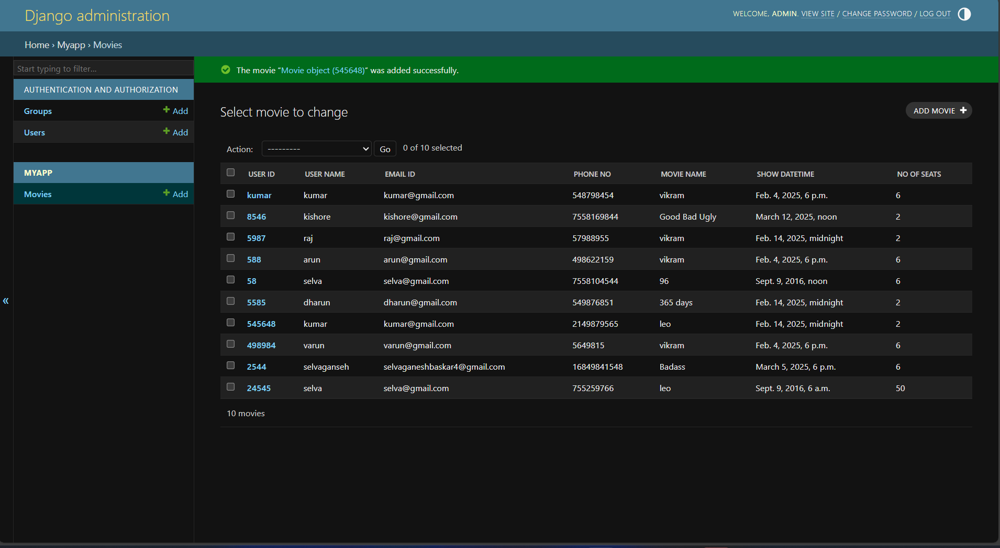

# Ex02 Django ORM Web Application
## Date: 10/4/2025

## AIM
To develop a Django application to store and retrieve data from Movies Database using Object Relational Mapping(ORM).

## ENTITY RELATIONSHIP DIAGRAM


## DESIGN STEPS

### STEP 1:
Clone the problem from GitHub

### STEP 2:
Create a new app in Django project

### STEP 3:
Enter the code for admin.py and models.py

### STEP 4:
Execute Django admin and create details for 10 books

## PROGRAM
```
models.py:
from django.db import models 
from django.contrib import admin 
class Employee (models.Model): 
    eid=models.CharField(max_length=20,help_text="Employee ID")
    name=models.CharField(max_length=100) 
    salary=models.IntegerField() 
    age=models.IntegerField() 
    email=models.EmailField() 

class EmployeeAdmin(admin.ModelAdmin): 
        list_display=( 'userid','username','movie_name','no_of_seat')


admin.py:from django.contrib import admin
from .models import Employee,EmployeeAdmin
admin.site.register(Employee,EmployeeAdmin)
```


## OUTPUT




## RESULT
Thus the program for creating a database using ORM hass been executed successfully
